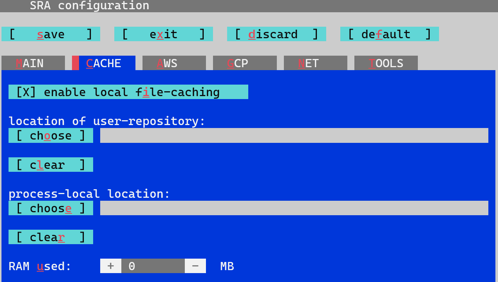

# SRA toolkit
## 一、前言

1. 目的：  测序成本的降低和测序速度的增加导致提交到Sequence Read Archive (SRA)的数据呈爆炸性增长，于是NCBI推出了SRAtoolkit技术来对数据进行压缩，以减少存储成本； 
2. 功能：SRA toolkit可以从SRA数据库读（“dumping”）序列文件，也可以将文件写 ("loading")成.sra格式。  
3. 优点：由于使用了完全索引的柱状数据库（fully indexed columnar database）设计，可以有效减少存储占用。cSRA技术提供了单一的工具包界面，支持高效压缩，读取数据片段，索引回收，序列化流水线处理数据，可选BAM标签的保留，有损压缩并且支持非标准参考序列。  
4. SRA toolkit工具获取地址：[获取地址](http://www.ncbi.nlm.nih.gov/Traces/sra/sra.cgi?view=software)
## 二、下载与安装
1. 师兄的方法: `最好直接选用brew安装 ` 
```
xuruizhi@DESKTOP-HI65AUV:~$ brew install sratoolkit

HOMEBREW_BREW_GIT_REMOTE set: using https://mirrors.tuna.tsinghua.edu.cn/git/homebrew/brew.git for Homebrew/brew Git remote.
HOMEBREW_CORE_GIT_REMOTE set: using https://mirrors.tuna.tsinghua.edu.cn/git/homebrew/homebrew-core.git for Homebrew/core Git remote.
Running `brew update --auto-update`...
Warning: sratoolkit 3.0.0 is already installed and up-to-date.
To reinstall 3.0.0, run:
  brew reinstall sratoolkit
```
brew安装完成之后，
输入vdb-config --interactive     
 #会出现一个框架，按字母x键退出，然后就可以使用啦  
  

输入 fastq-dump出现如下代码，则说明安装完成  
```
xuruizhi@DESKTOP-HI65AUV:~$ fastq-dump

Usage:
  /home/linuxbrew/.linuxbrew/Cellar/sratoolkit/3.0.0/bin/fastq-dump.3.0.0 [options] <path> [<path>...]
  /home/linuxbrew/.linuxbrew/Cellar/sratoolkit/3.0.0/bin/fastq-dump.3.0.0 [options] <accession>

Use option --help for more information

/home/linuxbrew/.linuxbrew/Cellar/sratoolkit/3.0.0/bin/fastq-dump.3.0.0 : 3.0.0
```
2. 网上的方法：
[地址,以Ubuntu64位举例安装](https://blog.csdn.net/weixin_45214599/article/details/114847650)  
3. 更改存储路径  
有时候需要从NCBI下载数据来完成所输入的命令，不同系统环境下默认的存储路径如下∶  
```
Linux: /home/[user_name]/ncbi/public
Mac OS X: /Users/[user_name]/ncbi/public
Windows: C:\Users\[user_name]\ncbi\public
```
我们可以使用 SRA Toolkit（2.4以上版本支持）配置工具来改变默认的存储路径，cd命令进入bin文件夹后，输入命令`./vdb-config-i`出现配置界面，如下图所示∶  
  

这里只有两个主要功能：设置下载权限（Enable Remote Access）和存储目录（Enable Local File Caching），用tab键选择项目，space和enter键进入设置，其中下载权限是默认开启的，如果要改变存储路径，则进入Enable Local File Caching，如下图所示：  
  
还不太确定如何修改成功  
## 三、SRA Toolkit 使用方法
1. fastq-dump  

SRA Toolkit中最常用的工具，主要功能是将SRA数据转换为fastq格式。相当于解压缩  

用法：
```
fastq-dump [options] <path/file>
```
常用参数:
```

-h      |       --help      输出所有参数、用法和版本信息
（使用该命令查看到的帮助信息比官方的使用文档介绍的参数更多。）

-V      |       --version  输出版本号。

--split-files        处理双末端测序数据时添加此参数，将原文件reads分为两个文件：
                    _1.fastq,_2fastq的形式。

--split-spot        将每一个reads分配给对应的spots。

--fasta <[line width]>        生成FASTA文件， 可以选择一行显示多少个碱基。

-I      |       --readids  在spot id后面添加read id（双末端数据使用）

-F      |       --origfmt  Defline只包含原始数据名称

-Q      |       --offset <integer>    用于ASCII质量分数的偏移量，默认是33（“！”）

-N      |       --minSpotId <rowid>        
                rowid值为解压到的最小的Spot Id. 和参数-X一起用来解压一个范围的数据.

-X      |       --maxSpotId <rowid>        rowid值为解压到的最大的Spot Id. 和参数-N一起用来解压一个范围的数据.

-M      |       --minReadLen <len> 过滤序列的长度：>=<len>

--skip-technical         只解压有生物学意义的reads.

--aligned                只解压比对序列.

--unaligned              只解压未比对序列.

-O      |       --outdir <path>         输出路径,默认是当前路径

-Z      |       --stdout    输出到标准输出。

--gzip        用gzip压缩输出结果.

--bzip2       用bzip2压缩输出结果.
```


常用命令行举例：
```

fastq-dump -X5 -Z *.sra

# 输出前5行到标准输出，在解压整个文件前可以用来查看数据，从而调整参数的使用。

fastq-dump --split-files --fasta 60 *.sra

# 双末端测序数据，生成两个fasta文件，每行60个碱基

fastq-dump --split-files --aligned -Q 64 *.sra

# 双末端测序数据，生成两个fastq，质量分数ASCII偏移量为64。
```
-----------------------------------
2. Prefetch  

使用方法:
```

prefetch [options] <path/SRA file |path/kart file> [<path/file> ...]

prefetch [options] <SRA accession>

prefetch [options] --list <kart_file>
```

Data transfer:
```

-f      |       --force <value> 三个值： no, yes,all. 参数默认为no: 如果检测到文件已经存在则停止下载;参数 yes: 即使文件存在也下载; 参数all: 忽略 lock 文件 (被占用的文件或者正在下载的文件).

--transport <value> 三个值：ascp, http,both. 三种不同的方式，默认为both：先ascp再http.

-l      |       --list列出 kart 文件的内容.

-s      |       --list-sizes         显示 kart 文件的内容的大小.

-o      |       --order <value>         Kart 下载顺序. 两个值: kart (按照kart文件顺序下载), size(按文件大小下载). 默认值: size.

-p      |       --progress <value>  显示下载完成度的时间间隔（分钟），默认1分钟.

--option-file <file>    从 file读取更多的选项和参数
```
-----------------------------------
3. sam-dump工具

常用参数
```
Data formatting:

-1      |       --primary只输出主要比对

-r      |       --header   重建header

-n      |       --no-header      不输出headers

-s      |       --seqid      在RNAME中输出参考SEQ_ID

-=      |       --hide-identical 如果碱基和参考数据相同则输出”=”。

--reverse  根据read类型反转没有匹配的

--rna-splicing    modify cigar-string and output flags if rna-splicing detected

Filtering:

-u      |       --unaligned       同时输出匹配的和未匹配的reads。

--aligned-region <name[:from-to]>设置匹配区域

--unaligned-spots-only     输出没有匹配的reads对应的spots

--min-mapq      输出最小的比对质量分数。
```

常用命令行举例：
```

sam-dump SRR390728.sra

# 转换为sam格式，输出结果到标准输出。

sam-dump --aligned-region 1:6484848-6521430--output-file *.sam *.sra

# 将指定区域（chr1，6484848-6521430）结果保存在*.sam中。
```
-----------------------------------
4. sra-pileup工具

使用方法:
```

sra-pileup [options] <path/file>[<path/file> ...]

sra-pileup [options] <accession>
```

常用参数:
```
-e      |       --seqname        使用初始的序列名称（比如chr1）而不是比对顺序.

--function count        输出每个碱基上的reads覆盖数.

--function mismatch         输出错配数.

--minmismatch         在“--function mismatch”中作为cutoff的最小的错配率，默认5.

-r      |       --aligned-region        设置比对区域。

-q      |       --minmapq <min. mapq>最低的映射质量，当比对低于该值时会被忽略，默认0.
```

常用命令行举例：
```

1.sra-pileup -r 1:559140-559160 *.sra

对指定基因组区域统计reads覆盖度，1号染色体, 位置559140-559160

2.sra-pileup -o output.txt --gzip--option-file list.txt *.sra

统计结果输出到output.txt 中，并使用gzip压缩，基因组位置从list.txt文件中获得。list.txt文件格式如下:

-r 1:559140-559141

-r 1:569145-569145

-r 1:579150-579150
```
-----------------------------------
## 四、在NCBI中查找基因信息举例
来获取文件  
```
prefetch SRR1553610
```
这些文件去哪里了→存在了你home目录下的一个默认文件夹里
```
ls ~/ncbi
```
里面添加了什么可以用工具find来查看
```
find ~/ncbi 
/home/sunchengquan/ncbi
/home/sunchengquan/ncbi/public 
/home/sunchengquan/ncbi/public/sra
/home/sunchengquan/ncbi/public/sra/SRR1553610.sra
```
我们用程序fastq-dump来把文件拆包
```
fastq-dump -h 
从NCBI下下来的数据，双端测序数据是放在一个文件里的，所以需要把它们重新拆解为两个文件
```
拆包文件
```
cd ncbi/public/sra/
fastq-dump --split-files SRR1553610 
FASTQ格式的原始数据文件已经在当前文件夹了
```
shell下的模式匹配。*（星号）表示可以匹配任何东西
```
wc -1 *.fastq 

879348 SRR1553610_1.fastq 
879348 SRR1553610_2.fastq 
1758696 总用量
```
查看文件
```
head SRR1553610_1.fastq 1
cat *.fastq | grep @SRR | wc -1
```
如何下载多个文件
```
echo SRR1553607 > sra.ids 
echo SRR1553605 >> sra.ids m
prefetch --option-file sra.ids
```
拆包下载好的所有文件
```
fastq-dump --split-files ~/ncbi/public/sra/SRR155360*
or
 cat sra.ids │ sed 's/SRR/fastq-dump --split-files SRR/'
```
